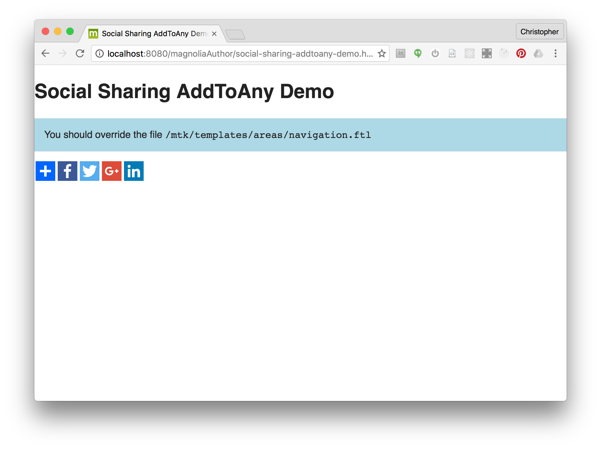
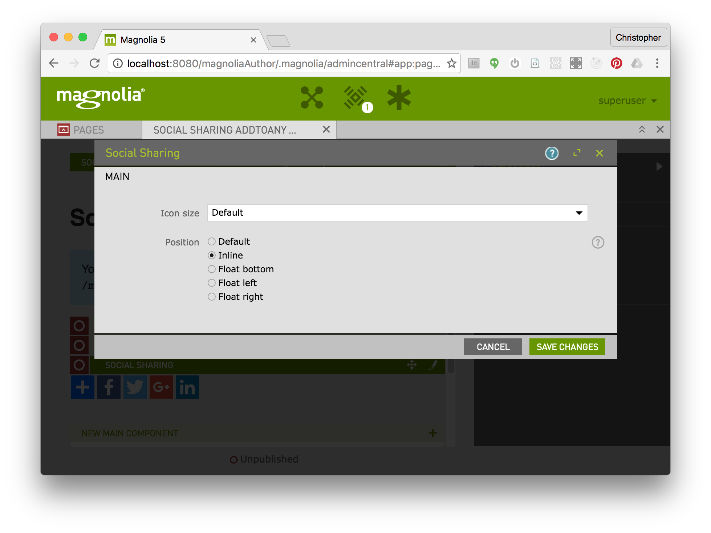

# Social Sharing - AddToAny - Component template for Magnolia CMS #

Easily add social sharing buttons to a page for facebook, twitter, google plus and other social networks using the simple AddToAny service.
An advantage of AddToAny is that you do not need to have a registered account with the free service.

## Features ##
Set size of icons, positioning of icons, and which social networks to display.
Includes a flyout to reveal additional social networks.
Default values can be set via parametes in the template definition, and they can be overridden by authors in the dialogs.
See https://www.addtoany.com/ for more information on the sharing service.

## Usage ##
Use this component as is, or simply as a starting point or inspiration for how to accomplish this common task.

* Include the css file in webresources on your pages.
* Include the following script tag on your pages: ``
* Make the template available in your page. (This is already done for the mtk basic page via a 'decoration'.)
* Add the Social Sharing component to your page.

## Usage - Customization ##
* To change the defaults, and also to set which services are displayed and whether the icons have rounded corners, edit the templates/components/socialSharing.yaml file.

### Demo ###
To see an example page demonstrating this component, open the Pages app in Magnolia AdminCentral and import the file in 'dev/importsSamples'.

## Dependencies ##
* The AddToAny service is used. If you are offline, the feature will not work.
* Also some of the services (such as Google Plus) will only work when the website is running on an actual internet domain, on localhost they will not function correctly.

## Information on Magnolia CMS
https://docs.magnolia-cms.com

This directory is a 'light module'.
https://documentation.magnolia-cms.com/display/DOCS/Light+development+in+Magnolia

## Contribute to the Magnolia component ecosystem
It's easy to create components for Magnolia and share them on github and npm. I invite you to do so and join the community. Let's stop wasting time by developing the same thing again and again, rather let's help each other out by sharing our work and create a rich library of components.

Just add magnolia-light-module and magnolia-component as keywords to the package.json to make them easy to find and use.

## Notes
* This is not officially supported Magnolia CMS code. This is a community contribution.
* Your input is welcome! Just file a ticket, or create a pull request on github.

## License

MIT

## Contributors

Christopher Zimmermann, @topherzee
